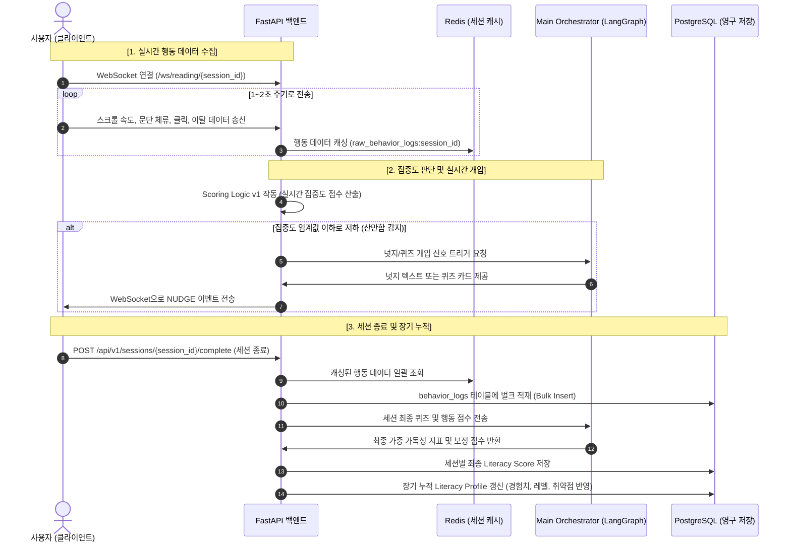
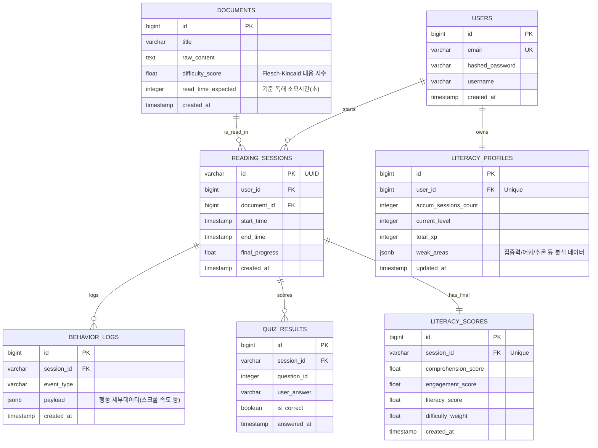

# [Architecture] ③ 백엔드 & 실시간 데이터 처리 (Backend & Real-time Data)

본 문서는 **2026 AI·SW 디지털 경진대회 SW부문**에 참가하는 **AllDayHappyDay** 팀의 프로젝트 **'AI 리터러시 케어 에이전트'** 중 **③ 백엔드 & 실시간 데이터 처리** 역할의 기술 아키텍처 및 설계 명세서이다.

이 시스템은 사용자의 읽기 행동(과정) 데이터를 실시간 수집하고 이해도(결과)를 결합하여 **Literacy Score**를 산출하고 장기적으로 추적하는 **폐루프(Closed-Loop) 문해력 성장 관리 시스템**의 인프라 역할을 담당한다.

---

## 1. 역할 개요
* **역할명**: ③ 백엔드 및 실시간 데이터 처리 (Backend & Real-time Data)
* **담당 에이전트/모듈**: `Cognitive Care 백엔드 API`, `WebSocket 데이터 스트리밍 서비스`, `데이터 적재 파이프라인 (PostgreSQL/Redis)`
* **핵심 목표**: 
  1. 클라이언트(브라우저 확장 프로그램 또는 웹 UI)로부터 발생하는 초 단위 미세 독해 행동 로그를 유실 없이 수집.
  2. 수집된 데이터를 Redis 임시 버퍼에 캐싱 후 PostgreSQL에 Bulk Insert하여 DB 부하 최소화.
  3. 행동 로그 기반 실시간 집중도 판단(Scoring Logic v1) 서비스 제공.
  4. 타 에이전트(코어, RAG 콘텐츠, 리워드)와의 인터페이스 API 구현 및 장기 누적 성장 프로필(Literacy Profile) 적재.

---

## 2. 백엔드 시스템 책임 범위
* **실시간 행동 로그 수집**: 스크롤 속도, 문단 체류 시간, 페이지 이탈(Tab Blur), 마우스 클릭, 읽기 진행률(Progress) 스트리밍 수집.
* **집중도 Scoring Logic v1 구현**: 행동 데이터를 정량화된 실시간 집중도(Engagement Score)로 산출하는 통계 및 경험적 수식 알고리즘 탑재.
* **성장 지표 누적 저장**: 퀴즈 정답률, 독해 진행률, 세션 결과를 바탕으로 사용자별 장기 문해력 성장 지표(Literacy Profile) 테이블 관리.
* **통합 지원 API**:
  * 세션 시작/종료 처리 및 최종 리터러시 점수 합성 API.
  * 퀴즈 풀이 결과 저장 및 검증 API.
  * 프론트엔드 성장 대시보드 시각화용 기간별/지문난이도별 데이터 집계 API.

---

## 3. 전체 데이터 흐름 (Data Flow)

시스템 내부의 데이터 흐름은 **[측정(WebSocket) $\rightarrow$ 분석/개입(Redis/Core) $\rightarrow$ 추적(PostgreSQL)]**의 루프로 순환한다.



---

## 4. 주요 모듈 구조 (Module Architecture)

FastAPI 애플리케이션의 아키텍처는 계층화 아키텍처(Layered Architecture)를 따르며, 비즈니스 로직과 데이터 인프라의 관심사를 명확히 분리한다.

```
app/
├── api/                    # REST API 라우터 (REST endpoints)
│   └── v1/
│       ├── auth.py         # 인증 및 세션 검증
│       ├── sessions.py     # 독해 세션 제어 및 완료 처리
│       ├── profile.py      # 장기 리터러시 프로필 조회
│       └── analytics.py    # 성장 대시보드 시각화용 집계 데이터
├── websocket/              # WebSocket 핸들러 및 연결 관리
│   ├── manager.py          # WebSocket Connection Manager (방 관리)
│   └── endpoint.py         # 행동 로그 수집 및 넛지 브로드캐스팅
├── core/                   # 공통 설정 및 라이브러리
│   ├── config.py           # 환경 변수 및 DB/Redis URL 설정
│   └── security.py         # JWT 토큰 검증 및 비밀번호 암호화
├── db/                     # DB 연결 구성
│   ├── session.py          # SQLAlchemy Session Local 설정
│   └── base_class.py       # ORM Model Base 정의
├── models/                 # SQLAlchemy ORM 모델 선언 (PostgreSQL)
│   ├── user.py
│   ├── document.py
│   ├── session.py
│   ├── log.py
│   ├── quiz.py
│   └── profile.py
├── schemas/                # Pydantic 데이터 검증 DTO
│   ├── user.py
│   ├── session.py
│   ├── quiz.py
│   └── profile.py
└── services/               # 비즈니스 로직 서비스 레이어
    ├── scoring.py          # 집중도 Scoring Logic v1 구현체
    ├── session_service.py  # Redis 버퍼 적재 및 PostgreSQL 마이그레이션
    └── reward_service.py   # 경험치(XP) 및 레벨업 메커니즘 연산
```

---

## 5. API 설계 (API Design)

### 5.1 REST API 엔드포인트 명세

| 기능 | HTTP Method | URL | 설명 |
| :--- | :--- | :--- | :--- |
| **세션 시작** | `POST` | `/api/v1/sessions/start` | 새로운 독해 세션 시작 및 세션 ID 생성 |
| **퀴즈 제출** | `POST` | `/api/v1/sessions/{session_id}/quiz` | 사용자가 푼 퀴즈 정답 제출 및 채점 결과 저장 |
| **세션 종료** | `POST` | `/api/v1/sessions/{session_id}/complete` | 세션 종료, 행동로그 벌크 적재, 최종 Literacy Score 합성 |
| **성장 프로필 조회** | `GET` | `/api/v1/profile/{user_id}` | 사용자 장기 성장 프로필 (현재 레벨, 누적 XP, 취약분야) 조회 |
| **대시보드 통계 조회** | `GET` | `/api/v1/analytics/summary` | 시계열 성장 곡선 시각화용 주간/월간 집계 데이터 반환 |

### 5.2 핵심 API Request/Response DTO 예시

#### [POST] `/api/v1/sessions/start` (세션 시작)
* **Request Body**
```json
{
  "user_id": 1,
  "document_id": 42
}
```
* **Response Body**
```json
{
  "session_id": "sess_89cf3b12-9c12-4d89-b88a-2115db01f14c",
  "status": "active",
  "created_at": "2026-06-21T17:00:00Z"
}
```

#### [POST] `/api/v1/sessions/{session_id}/complete` (세션 종료 & 점수 계산)
* **Request Body**
```json
{
  "final_progress": 100.0
}
```
* **Response Body**
```json
{
  "session_id": "sess_89cf3b12-9c12-4d89-b88a-2115db01f14c",
  "duration_seconds": 320,
  "literacy_score": 84.5,
  "comprehension_score": 90.0,
  "engagement_score": 79.0,
  "xp_gained": 150,
  "is_level_up": false,
  "updated_at": "2026-06-21T17:05:20Z"
}
```

---

## 6. WebSocket 이벤트 설계 (WebSocket Event Design)

실시간 행동 데이터는 웹소켓 커넥션을 유지하며 JSON 포맷의 이벤트 메시지로 수집된다.

* **엔드포인트**: `ws://<domain>/ws/reading/{session_id}?token=<jwt_token>`
* **프로토콜 구조**: `client -> server` (로그 전송), `server -> client` (실시간 개입/피드백)

### 6.1 클라이언트 $\rightarrow$ 백엔드 수집 이벤트 예시

#### ① 스크롤 이벤트 (`SCROLL`)
```json
{
  "event": "scroll",
  "timestamp": 1782042001.23,
  "scroll_speed": 120.5,
  "scroll_direction": "down"
}
```

#### ② 문단 체류 시간 이벤트 (`PARAGRAPH_STAY`)
```json
{
  "event": "paragraph_stay",
  "timestamp": 1782042010.50,
  "paragraph_index": 3,
  "duration": 12.4
}
```

#### ③ 포커스 아웃/이탈 이벤트 (`TAB_FOCUS`)
```json
{
  "event": "tab_focus",
  "timestamp": 1782042045.10,
  "focused": false
}
```

#### ④ 독해 진행률 이벤트 (`PROGRESS`)
```json
{
  "event": "progress",
  "timestamp": 1782042060.00,
  "progress_percentage": 45.0
}
```

### 6.2 백엔드 $\rightarrow$ 클라이언트 송신 이벤트 예시

#### 넛지 개입 이벤트 (`NUDGE`)
집중도 계산 로직에 의해 집중력 저하가 감지될 경우, 백엔드는 WebSocket을 통해 즉각 클라이언트로 넛지 이벤트를 밀어준다. (① 오케스트레이터의 라우팅 결정과 연동)
```json
{
  "event": "nudge",
  "timestamp": 1782042080.00,
  "nudge_type": "medium",
  "message": "잠시 멈춰 다시 읽어볼까요? 이 문단에서 속도가 너무 빨라졌습니다."
}
```

---

## 7. PostgreSQL 테이블 설계 (PostgreSQL Schema)

데이터의 관계성 일관성을 유지하고, 장기 문해력 시계열 통계를 처리하기 위한 데이터베이스 스키마 설계이다.



### 7.1 DDL (Data Definition Language) SQL

```sql
-- Users Table
CREATE TABLE users (
    id BIGSERIAL PRIMARY KEY,
    email VARCHAR(255) UNIQUE NOT NULL,
    hashed_password VARCHAR(255) NOT NULL,
    username VARCHAR(100) NOT NULL,
    created_at TIMESTAMP WITH TIME ZONE DEFAULT CURRENT_TIMESTAMP
);

-- Documents Table
CREATE TABLE documents (
    id BIGSERIAL PRIMARY KEY,
    title VARCHAR(255) NOT NULL,
    raw_content TEXT NOT NULL,
    difficulty_score DOUBLE PRECISION NOT NULL, -- 한국어 가독성 난이도
    read_time_expected INTEGER NOT NULL, -- 예상 독해 시간(초)
    created_at TIMESTAMP WITH TIME ZONE DEFAULT CURRENT_TIMESTAMP
);

-- Reading Sessions Table
CREATE TABLE reading_sessions (
    id VARCHAR(50) PRIMARY KEY, -- sess_ UUID 형식
    user_id BIGINT REFERENCES users(id) ON DELETE CASCADE,
    document_id BIGINT REFERENCES documents(id) ON DELETE CASCADE,
    start_time TIMESTAMP WITH TIME ZONE NOT NULL,
    end_time TIMESTAMP WITH TIME ZONE,
    final_progress DOUBLE PRECISION DEFAULT 0.0,
    created_at TIMESTAMP WITH TIME ZONE DEFAULT CURRENT_TIMESTAMP
);

-- Behavior Logs Table (JSONB 활용 벌크 적재 최적화)
CREATE TABLE behavior_logs (
    id BIGSERIAL PRIMARY KEY,
    session_id VARCHAR(50) REFERENCES reading_sessions(id) ON DELETE CASCADE,
    event_type VARCHAR(50) NOT NULL, -- SCROLL, PARAGRAPH_STAY, etc.
    payload JSONB NOT NULL,
    created_at TIMESTAMP WITH TIME ZONE DEFAULT CURRENT_TIMESTAMP
);
CREATE INDEX idx_behavior_logs_session ON behavior_logs(session_id);

-- Quiz Results Table
CREATE TABLE quiz_results (
    id BIGSERIAL PRIMARY KEY,
    session_id VARCHAR(50) REFERENCES reading_sessions(id) ON DELETE CASCADE,
    question_id INTEGER NOT NULL,
    user_answer VARCHAR(255) NOT NULL,
    is_correct BOOLEAN NOT NULL,
    answered_at TIMESTAMP WITH TIME ZONE DEFAULT CURRENT_TIMESTAMP
);

-- Literacy Scores Table (세션 최종 집계 점수)
CREATE TABLE literacy_scores (
    id BIGSERIAL PRIMARY KEY,
    session_id VARCHAR(50) UNIQUE REFERENCES reading_sessions(id) ON DELETE CASCADE,
    comprehension_score DOUBLE PRECISION NOT NULL,
    engagement_score DOUBLE PRECISION NOT NULL,
    literacy_score DOUBLE PRECISION NOT NULL,
    difficulty_weight DOUBLE PRECISION NOT NULL,
    created_at TIMESTAMP WITH TIME ZONE DEFAULT CURRENT_TIMESTAMP
);

-- Literacy Profiles Table (장기 학습 상태 기록)
CREATE TABLE literacy_profiles (
    id BIGSERIAL PRIMARY KEY,
    user_id BIGINT UNIQUE REFERENCES users(id) ON DELETE CASCADE,
    accum_sessions_count INTEGER DEFAULT 0,
    current_level INTEGER DEFAULT 1,
    total_xp INTEGER DEFAULT 0,
    weak_areas JSONB DEFAULT '{}'::jsonb, -- 취약 영역 리스트 및 강도
    updated_at TIMESTAMP WITH TIME ZONE DEFAULT CURRENT_TIMESTAMP
);
```

---

## 8. Redis 사용 방식 (Redis Usage Pattern)

실시간 읽기 파이프라인에서 Redis는 디스크 I/O 병목을 줄이고 인메모리 응답 속도를 극대화하는 용도로 활용된다.

### 8.1 주요 사용 목적
1. **실시간 행동 로그 버퍼링**: WebSocket을 통해 수집되는 초 단위 미세 데이터는 RDB에 즉시 쓰지 않고, Redis List 구조에 버퍼링한다. 이후 세션이 정상 종료되거나 타임아웃될 때 일괄 PostgreSQL에 벌크 저장한다.
2. **세션 실시간 상태 정보 캐싱**: 현재 유저의 독해 위치(Paragraph Index), 마지막 업데이트 타임스탬프, 탭 포커스 아웃 여부를 실시간 조회용 해시로 관리하여 집중도 계산 및 넛지 판단의 고속 처리를 가능하게 한다.
3. **리워드 경험치(XP) 버퍼**: 실시간 읽기 활동(예: 문단 완독)에 대해 획득하는 임시 누적 경험치를 빠르게 업데이트한다.

### 8.2 Redis 키 및 자료구조 설계

| Key 패턴 | 자료구조 | TTL | 설명 |
| :--- | :--- | :--- | :--- |
| `raw_behavior:{session_id}` | **List** | 2시간 | 실시간 유입되는 JSON 행동 로그 문자열을 `RPUSH`로 적재. 세션 종료 시 가져와 DB에 벌크 저장 후 삭제. |
| `session_state:{session_id}` | **Hash** | 2시간 | 실시간 상태 관리. 필드: `current_paragraph`, `last_active_time`, `is_focused`, `progress`. |
| `temp_xp:{user_id}:{session_id}` | **String** | 1일 | 한 독해 세션 동안 유저가 실시간 획득한 임시 경험치(XP) 값 저장. |

---

## 9. 집중도 점수 계산 로직 초안 (Scoring Logic v1)

우리가 제안하는 **집중도 점수 (Engagement Score)**는 단순히 읽는 시간만을 반영하는 것이 아니라, 사용자의 미세 행동을 인지부하(Cognitive Load) 모델에 대입하여 산출한다.

### 9.1 수학적 모델 설계

세션 최종 집중도 점수 $S_{engagement}$는 다음과 같이 4가지 하위 점수의 가중 합산으로 계산된다.

$$S_{engagement} = w_{scroll} \cdot S_{scroll} + w_{stay} \cdot S_{stay} + w_{exit} \cdot S_{exit} + w_{progress} \cdot S_{progress}$$

* **가중치 총합**: $w_{scroll} + w_{stay} + w_{exit} + w_{progress} = 1.0$ (v1 권장치: $0.2$, $0.3$, $0.2$, $0.3$)

#### ① 스크롤 속도 안정성 점수 ($S_{scroll}$)
사용자의 스크롤 속도 $V_{scroll}$가 해당 문서 난이도 대비 최적의 독해 속도 $V_{expected}$ 구간을 충족하는지 가우시안 확률 밀도 분포 형태로 평가한다. 너무 빠른 스크롤(찍기 의심)과 너무 느리거나 멈춰있는 스크롤(방치 의심) 모두 감점 대상이다.

$$S_{scroll} = \exp\left( - \frac{(V_{scroll} - V_{expected})^2}{2 \sigma^2} \right) \times 100$$
*(단, $V_{scroll}$이 극한으로 낮거나 높을 경우 하한선 점수 적용)*

#### ② 문단 체류 일관성 점수 ($S_{stay}$)
문단의 글자 수(Words Count) 기준 표준 독해 시간 $T_{expected, i}$ 대비 실제 문단 체류 시간 $T_{actual, i}$의 상대적 편차를 측정한다.
$$S_{stay} = \frac{1}{N} \sum_{i=1}^{N} \max\left(0, 1 - \frac{|T_{actual, i} - T_{expected, i}|}{T_{expected, i}}\right) \times 100$$

#### ③ 이탈 감점 점수 ($S_{exit}$)
탭 전환 및 브라우저 창 최소화(Tab Blur)에 따른 독해 흐름 중단 횟수($C_{exit}$) 및 이탈 누적 시간($T_{exit}$)을 기반으로 차감한다.
$$S_{exit} = \max(0, 100 - (C_{exit} \times 10) - (T_{exit} \times 0.5))$$

#### ④ 독해 진척도 점수 ($S_{progress}$)
글을 얼마나 완성도 있게 끝까지 읽었는지 나타낸다. (최종 페이지 도달율 및 마지막 문단 조회 여부 반영)
$$S_{progress} = \text{Final Progress Percentage} \in [0.0, 100.0]$$

### 9.2 계산 로직 구현 코드 (Python 스텁 예시)

```python
import math
from typing import List, Dict

class ConcentrationScorerV1:
    def __init__(
        self,
        expected_speed: float,      # 단어/초 혹은 스크롤 픽셀/초 기준
        expected_stay_times: List[float], # 문단별 예상 체류시간 리스트 (초)
        w_scroll: float = 0.2,
        w_stay: float = 0.3,
        w_exit: float = 0.2,
        w_progress: float = 0.3
    ):
        self.expected_speed = expected_speed
        self.expected_stay_times = expected_stay_times
        self.weights = {
            "scroll": w_scroll,
            "stay": w_stay,
            "exit": w_exit,
            "progress": w_progress
        }

    def calculate_scroll_score(self, avg_speed: float) -> float:
        if avg_speed <= 0:
            return 0.0
        # 가우시안 분포 형태 평가, 편차 분산(sigma)은 기대속도의 50%로 가정
        sigma = self.expected_speed * 0.5
        score = math.exp(-((avg_speed - self.expected_speed) ** 2) / (2 * (sigma ** 2)))
        return score * 100.0

    def calculate_stay_score(self, actual_stay_times: List[float]) -> float:
        n = min(len(actual_stay_times), len(self.expected_stay_times))
        if n == 0:
            return 0.0
        
        deviations = []
        for i in range(n):
            actual = actual_stay_times[i]
            expected = self.expected_stay_times[i]
            if expected <= 0:
                continue
            # 편차 계산 (예상시간 대비 편차가 클수록 낮은 점수)
            dev = max(0.0, 1.0 - (abs(actual - expected) / expected))
            deviations.append(dev)
            
        return (sum(deviations) / len(deviations)) * 100.0

    def calculate_exit_score(self, exit_count: int, exit_duration: float) -> float:
        # 이탈 1회당 10점 감점, 이탈 1초당 0.5점 감점
        base = 100.0 - (exit_count * 10.0) - (exit_duration * 0.5)
        return max(0.0, base)

    def compute_final_engagement(
        self,
        avg_speed: float,
        actual_stay_times: List[float],
        exit_count: int,
        exit_duration: float,
        final_progress: float
    ) -> float:
        s_scroll = self.calculate_scroll_score(avg_speed)
        s_stay = self.calculate_stay_score(actual_stay_times)
        s_exit = self.calculate_exit_score(exit_count, exit_duration)
        s_prog = final_progress # 0.0 ~ 100.0
        
        final_score = (
            self.weights["scroll"] * s_scroll +
            self.weights["stay"] * s_stay +
            self.weights["exit"] * s_exit +
            self.weights["progress"] * s_prog
        )
        return round(final_score, 2)
```

---

## 10. 다른 팀원 파트와의 연동 지점 (Integration)

백엔드 파트는 서비스의 척추로서 모든 역할 파트와 결합한다.

* **① 에이전트 코어 / 오케스트레이션 (이소희)**:
  * **연동 방식**: REST API 및 Shared State (Redis)
  * **상세**: 코어가 독해 세션 전환 상태(`Content Reducer -> Cognitive Care -> Reward -> Profile`)를 추적할 때 백엔드의 세션 상태 API를 조회한다. 또한, 집중력 저하로 인한 넛지 트리거 여부를 판별하기 위해 백엔드가 제공하는 Scoring 서비스 결과값을 활용한다.
* **② 콘텐츠 & RAG 에이전트**:
  * **연동 방식**: PostgreSQL 문서 난이도 동기화 API
  * **상세**: 지문 가독성(Flesch-Kincaid 가독성 지수 대응 알고리즘) 평가값과 퀴즈셋 질문 정보를 백엔드 DB(`documents` 테이블)에 적재하여, 사용자가 올바른 난이도의 퀴즈를 풀 수 있게 설계한다.
* **④ 프론트엔드 & 시각화**:
  * **연동 방식**: WebSocket 데이터 송신 및 JSON API 연동
  * **상세**: 클라이언트에서 스크롤 및 탭 전환 이벤트를 수신하고, 최종 점수(`Literacy Score`) 결과 전후 비교 데이터와 장기 성장 대시보드 데이터를 REST API로 응답한다.
* **⑤ QA / 평가 & 통합**:
  * **연동 방식**: 테스트 모듈 및 목업 API 데이터 제공
  * **상세**: `pytest`를 통한 단위/통합 테스트 자동화 파이프라인(CI) 연동을 지원하고, 웹소켓에 무작위 행동 스트림 데이터를 밀어넣어 예외 처리가 가능한 테스트 하네스를 구축한다.

---

## 11. 개발 마일스톤 및 최소 구현 범위 (Milestones)

대회 기간 중 백엔드 파트의 마일스톤별 최소 구현 범위(MVP) 정의이다.

### [M0] 셋업 및 E2E 통신 성공 (~6/22)
* **목표**: 인프라 기본 환경 구축 및 더미 데이터 E2E 통신 확보.
* **최소 범위**:
  * FastAPI 백엔드 스캐폴딩 및 Docker-compose 환경(PostgreSQL, Redis) 구축.
  * DB 스키마 1차 마이그레이션 스크립트 작성.
  * 기본 WebSocket 연결 구축 후, 프론트엔드가 보내는 더미 JSON 행동 데이터 적재 로그 확인.

### [M1] 핵심 폐루프 시연 버전 완성 (~6/29)
* **목표**: 글 1편에 대한 읽기 과정 $\rightarrow$ 개입 $\rightarrow$ 점수화의 흐름 시연 성공.
* **최소 범위**:
  * 실제 사용자의 스크롤, 체류시간, 이탈 이벤트를 Redis List에 임시 저장하고, 세션 종료 시 PostgreSQL에 벌크 저장하는 데이터 파이프라인 구축.
  * 집중도 Scoring Logic v1 알고리즘 구현 및 퀴즈 제출/채점 결과 저장 API 구현.
  * 세션 완료 요청 수신 시, 이해도(퀴즈 정답률)와 집중도를 합성한 최종 `Literacy Score` 계산 로직 작동.

### [M2] 전 기능 통합 및 시계열 추적 지원 (~7/6)
* **목표**: 여러 지문 독해 로그 누적 및 성장 프로필 데이터 서빙 지원.
* **최소 범위**:
  * 장기 누적 학습 데이터를 관리하는 `Literacy Profile` 갱신 로직 구현.
  * 성장 대시보드를 위한 시계열 통계 API 및 누적 경험치(XP)/레벨업 리워드 데이터 집계 로직 완성.
  * 대량 행동 로그 누적 시 발생할 수 있는 데이터베이스 인덱싱 튜닝 및 QA 하네스 테스트 통과.

---

## 12. 폴더 구조 예시 (Workspace Layout)

백엔드 코드베이스가 위치할 기본 폴더 구조 구조는 다음과 같다. 

```text
literacy-backend/
├── app/
│   ├── api/
│   │   ├── __init__.py
│   │   ├── v1/
│   │   │   ├── auth.py
│   │   │   ├── sessions.py
│   │   │   ├── profile.py
│   │   │   └── analytics.py
│   ├── websocket/
│   │   ├── __init__.py
│   │   ├── manager.py
│   │   └── endpoint.py
│   ├── core/
│   │   ├── config.py
│   │   └── security.py
│   ├── db/
│   │   ├── session.py
│   │   └── base.py
│   ├── models/
│   │   ├── user.py
│   │   ├── document.py
│   │   ├── session.py
│   │   ├── log.py
│   │   ├── quiz.py
│   │   └── profile.py
│   ├── schemas/
│   │   ├── user.py
│   │   ├── session.py
│   │   ├── quiz.py
│   │   └── profile.py
│   ├── services/
│   │   ├── scoring.py
│   │   ├── session_service.py
│   │   └── reward_service.py
│   └── main.py
├── tests/
│   ├── conftest.py
│   ├── test_api/
│   └── test_websocket/
├── Dockerfile
├── docker-compose.yml
├── requirements.txt
└── README.md
```

---

## 13. 추후 확장 가능성 (Future Extensibility)

본 아키텍처는 대회 이후 상용 시스템으로 고도화될 때 다음과 같은 확장을 고려하여 유연하게 설계되었다.

* **비동기 메시지 큐 도입 (Kafka 또는 RabbitMQ)**: 동시 접속 사용자 수가 대폭 증가할 경우, 백엔드 서버(FastAPI)가 웹소켓 행동 데이터를 수집한 뒤 즉시 메시지 브로커로 전달하고, 뒷단의 Consumer가 이를 비동기 분산 처리하게 함으로써 DB/Memory 병목을 예방할 수 있다.
* **기계 학습 기반 Scoring Logic v2**: v1의 가우시안 및 감점 기반 휴리스틱 계산 공식을 진화시켜, 축적된 사용자의 행동 로그 패턴과 실제 최종 퀴즈 정답률(이해도) 간의 상관관계를 기계학습 모델(예: LSTM, Transformer)에 학습시켜 고도화된 개인 맞춤형 인지부하 점수를 산출하도록 한다.
* **LLM 모니터링 로그 통합**: 에이전트들의 LLM 사용 정보(비용, 지연시간, 토큰 소모량)를 백엔드 DB의 전용 감사 테이블(Audit Logs)에 주기적으로 수집하여 대시보드에서 비용 통계를 제공하도록 연동한다.
